# Serverless_notes

**DYNAMO DB link SDK for reference - https://docs.aws.amazon.com/AWSJavaScriptSDK/latest/AWS.html**

# Getting Stated with Dynamo DB

**Lambda Configuration**
This is just for the first example where in you will call dynamo db function

*Dont forget to call dynamodb in your lambda, to do this follow the docs.aws.amazon.com link I sent above and find constructor how to do it. Anyway, below is the specific line*

**Sending a Request Using DynamoDB**

```javascript
var dynamodb = new AWS.DynamoDB();
dynamodb.batchExecuteStatement(params, function (err, data) {
  if (err) console.log(err, err.stack); // an error occurred
  else     console.log(data);           // successful response
});
##Locking the API Version
##In order to ensure that the DynamoDB object uses this specific API, you can construct the ##object by passing the apiVersion option to the constructor:

var dynamodb = new AWS.DynamoDB({apiVersion: '2012-08-10'});

##If you are not in specific region where you deployed the database, its required to put the region like the one below:
const dynamodb = new AWS.dynamodb({region:'us-west-2', apiVersion: '2012-08-10'});

```


**Example Code**
```javascript
const AWS = require('aws-sdk');
const dynamodb = new AWS.DynamoDB({region:'us-west-2', apiVersion: '2012-08-10'});

exports.handler = (event,context,callback) => {
    console.log(event);
    const age= event.age;
    callback(null, age * 2);
};
```

# HOW TO PUT ITEMS in the dynamo db created

There must be Table and Item *please see the dynamodb.putitem function*

/* This example adds a new item to the Music table. */

```javascript
var params = {
  Item: {
   "AlbumTitle": {
     S: "Somewhat Famous"
    }, 
   "Artist": {
     S: "No One You Know"
    }, 
   "SongTitle": {
     S: "Call Me Today"
    }
  }, 
  ReturnConsumedCapacity: "TOTAL", 
  TableName: "Music"
 };
 dynamodb.putItem(params, function(err, data) {
   if (err) console.log(err, err.stack); // an error occurred
   else     console.log(data);           // successful response
   /*
   data = {
    ConsumedCapacity: {
     CapacityUnits: 1, 
     TableName: "Music"
    }
   }
   */
 });
```

 **Hence this is the final code in the lambda for putting data, by the way, I am using Node js 16.X**

```javascript
const AWS = require('aws-sdk')
const dynamodb = new AWS.DynamoDB({region:'us-west-2', apiVersion: '2012-08-10'});
exports.handler = (event,context,callback) => {
    
    const params = {
        Item: {
            "UserId": {
                S: "grace-adsdasw"
            },
            "Age": {
                N: "28"
            },
            "Height": {
                N: "161"
            },
            "Income": {
                N: "2500"
            }
        },
        TableName:"grace-compare-yourself"
    };
    dynamodb.putItem(params, function(err, data) {
        if (err) {
            console.log(err);
            callback(err); 
        } else {
            console.log(data);
            callback(null, data)
        }
            });
    };
```

# TESTING THE LAMBDA CODE WHERE YOU WANT TO PUT ITEMS IN DYNAMODB


You will see that access denied. 

# Setting Permission Right in DynamoDB

You can search "IAM" role in AWS


We need to attach new policy


*Once you tested it, it will return empty result because you havent configured yet the desired return*

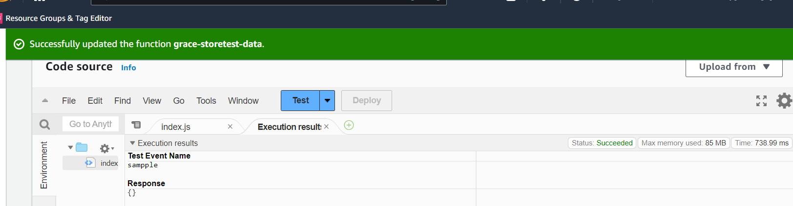

*When you got to the dynamodb again, you will see that there was added item in the table, this was executed when you tested you lamnda function which puts data in the dynamodb table*


# Using Api Gateway(Request) Data for Item Creation


Go to API gateway and check the template for POST request >> Integration Request >> Body Mapping Templates >>

On the script below, we are only forwarding age

```javascript
#set($inputRoot = $input.path('$'))
{
  "age" : $inputRoot.age
}
```

WE can live it either blank to forward the whole request or forward height and income as well like this one:

```javascript
#set($inputRoot = $input.path('$'))
{
  "age" : "$inputRoot.age",
  "height" : "$inputRoot.height",
  "income" : "$inputRoot.income"
}
```


Now we will tweak our code to access mapping template to the lambda function.
The main problem is now is in the lambda function dynamodb must always accept string and the dynamodb must be the one to format it to wither (S for string and N for number). To solve the problem, just go to integration request and wrapped the data to quotation like this one "$inputRoot.income".

```javascript
const AWS = require('aws-sdk')
const dynamodb = new AWS.DynamoDB({region:'us-west-2', apiVersion: '2012-08-10'});
exports.handler = (event,context,callback) => {
    
    const params = {
        Item: {
            "UserId": {
                S: "user_" + Math.random()
            },
            "Age": {
                N: event.age
            },
            "Height": {
                N: event.height
            },
            "Income": {
                N: event.income
            }
        },
        TableName:"grace-compare-yourself"
    };
    dynamodb.putItem(params, function(err, data) {
        if (err) {
            console.log(err);
            callback(err); 
        } else {
            console.log(data);
            callback(null, data)
        }
            });
    };
```

Now lets test it 

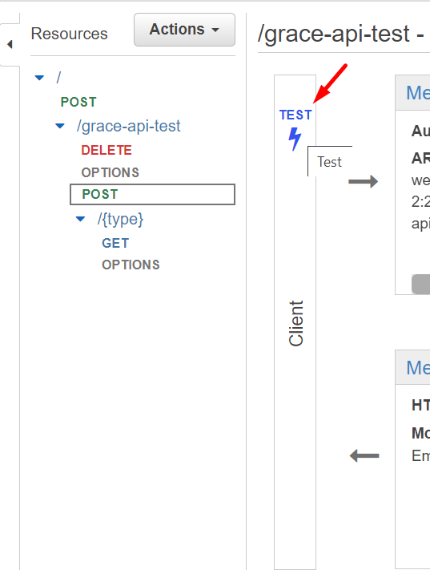
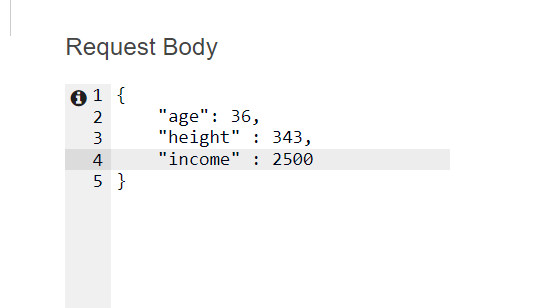

You will see the response body below {} and status code is 200. This means that it was executed
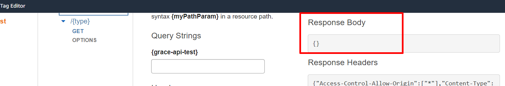

And then, if you look at dynamo table there was a user created with the specific payload from json
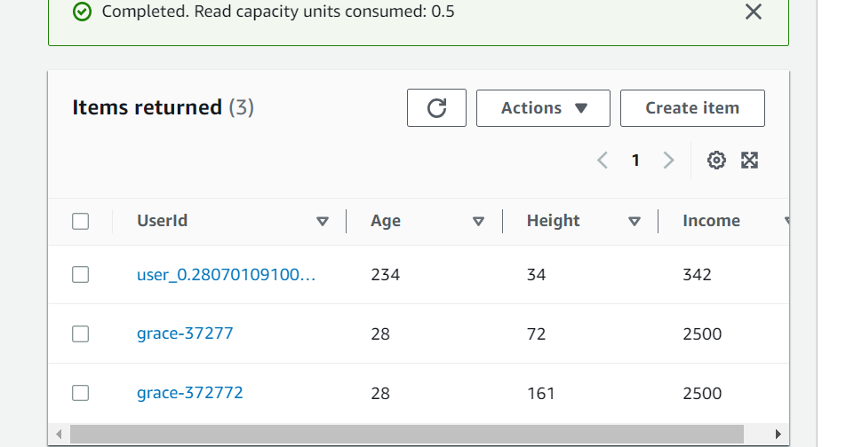

# Mapping the response and Web Testing

Last section we mapped the api gateway integration request to lambda and then put the data
to dynamo db

In the integration response, we just pass everything
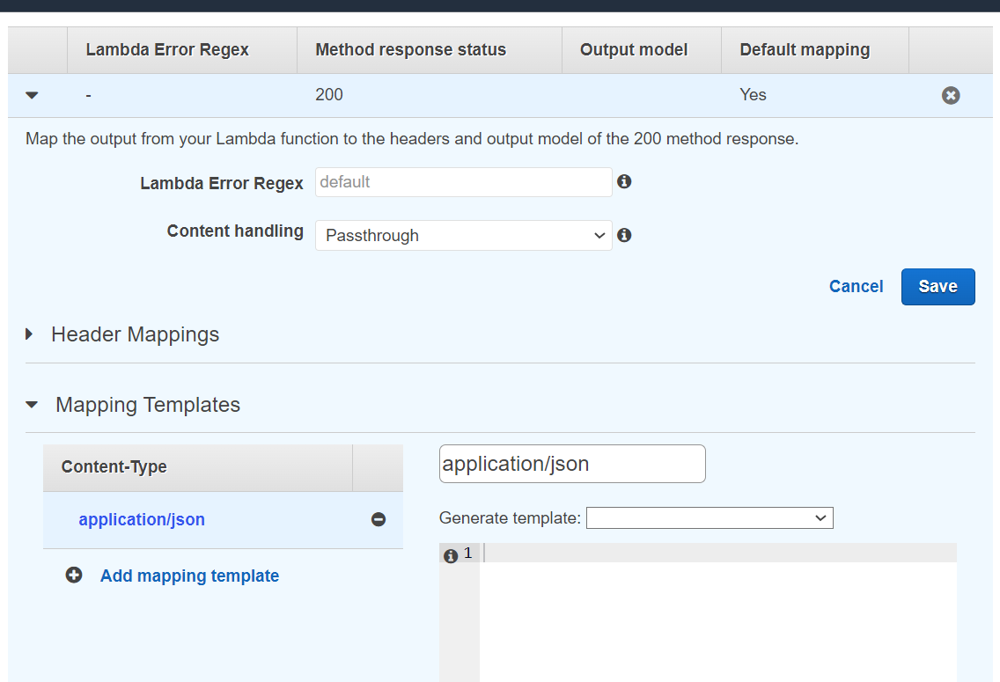

Now going to codepen.io to test the POST API

https://codepen.io/

```javascript
var xhr = new XMLHttpRequest();
xhr.open('POST','deploy api url');
xhr.onreadystatechange = function(event) {
    console.log(event.target.response);
};
xhr.setRequestHeader('Content-Type', 'application/json');
xhr.send(JSON.stringify({age:28, height:72, income:3500}));
```

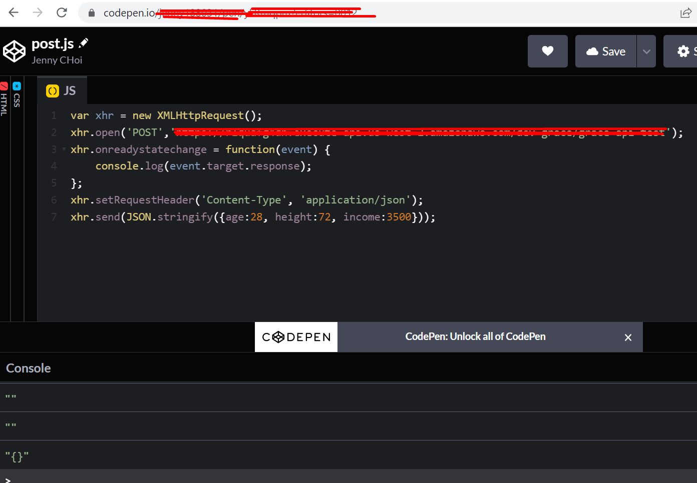

After executing the script to codepen.io, another item added to dynamodb table
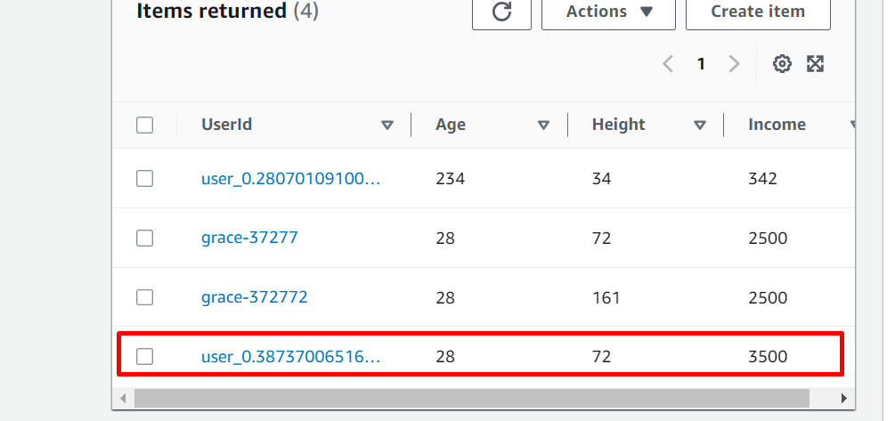

# Scanning Data in DynamoDB from Lambda

Previously, when we are not using dynamodb, we have the function below

```javascript
exports.handler = (event, context, callback) => {
    const type = event.type;
    if (type === 'all') {
        callback(null, 'all data!');
    } else if (type === 'single') {
        callback(null,'Just my data');
    } else {
        callback(null,'Hello from Lambda')
    }
}
```

now we are adding dynamodb and aws-sdk module in the script the result was below

```javascript
const AWS = require('aws-sdk')
const dynamodb = new AWS.DynamoDB({region:'us-west-2', apiVersion: '2012-08-10'});

exports.handler = (event, context, callback) => {
    const type = event.type;
    if (type === 'all') {
        callback(null, 'all data!');
    } else if (type === 'single') {
        callback(null,'Just my data');
    } else {
        callback(null,'Hello from Lambda')
    }
}
```

Now lets go to https://docs.aws.amazon.com/AWSJavaScriptSDK/latest/AWS.html to check function to get or scan data in dynamodb

Find the scan function there

```javascript
const AWS = require('aws-sdk')
const dynamodb = new AWS.DynamoDB({region:'us-west-2', apiVersion: '2012-08-10'});

exports.handler = (event, context, callback) => {
    const type = event.type;
    if (type === 'all') {
        const params = {
            TableName: "grace-compare-yourself"
        };
        dynamodb.scan(params,function(err,data) {
            if (err) {
                console.log(err);
                callback(err);
            } else {
                console.log(data);
                callback(null, data);
            }
        });
    } else if (type === 'single') {
        callback(null,'Just my data');
    } else {
        callback(null,'Hello from Lambda')
    }
}
```

*take note that dynamodb has scan limitation as it can only take upto 1 MB scan limitatiob. If it was already more that 1 MB, it will return with additional attribute which was the last evaluated key. You know you can pick up on the last key and start another scan*

More details in this part of API documentation
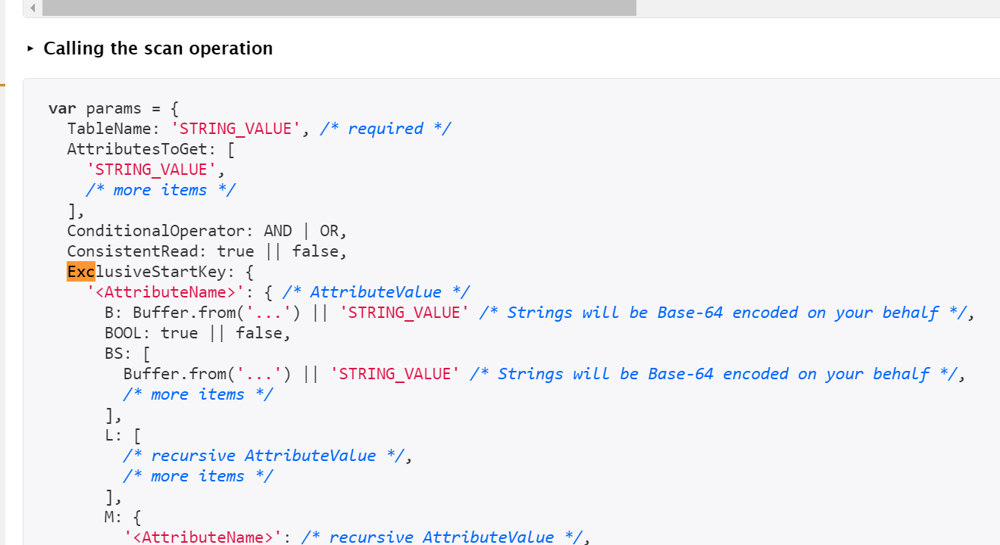

Now testing it with type all

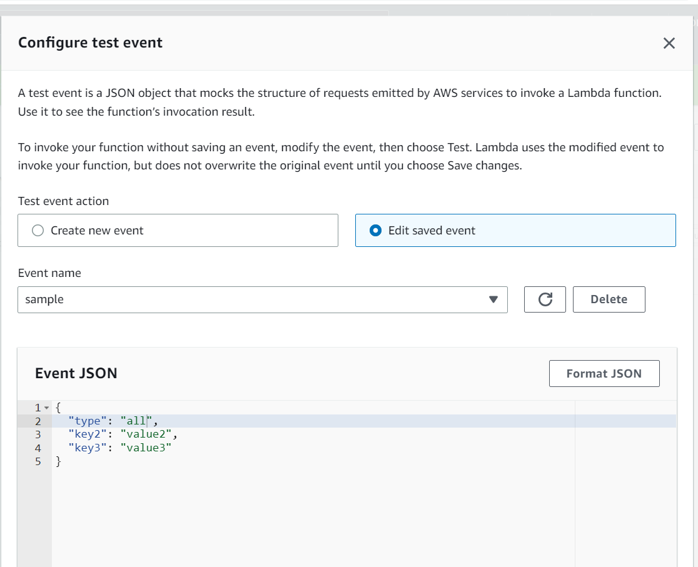

You see that it return the table items

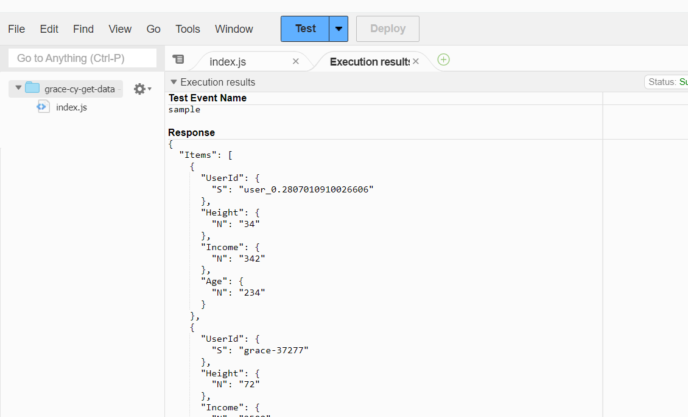

# Improving the IAM Permissions

Its not a good practice to permit all dynamodb as we did on last topic. WE added all policy like the one below


We can create a custom polcies

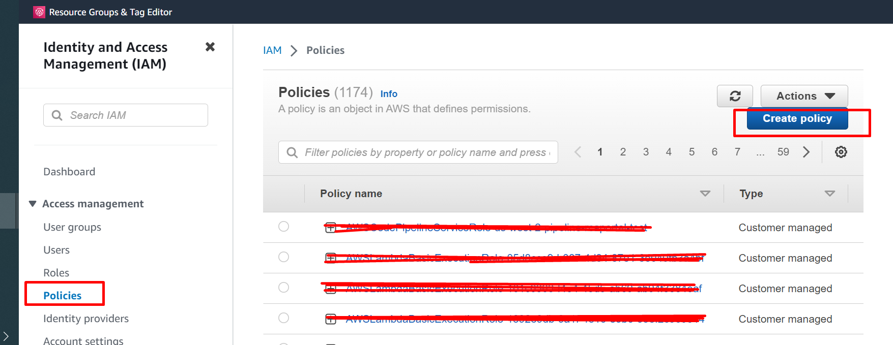

Adding only putitem

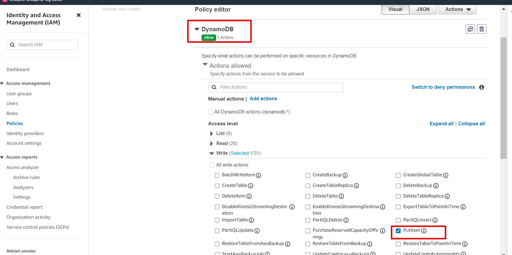


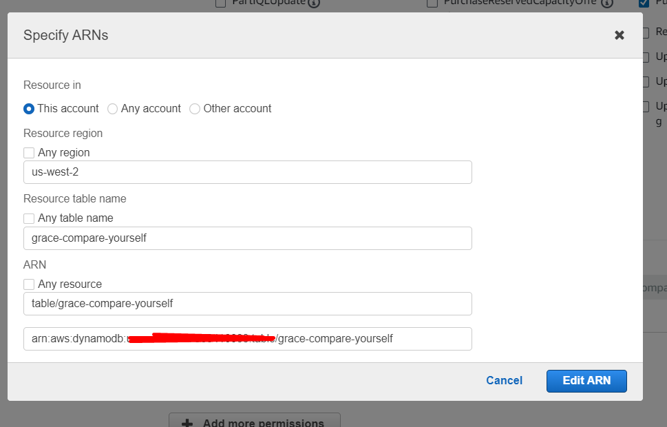

Remove the dynamodb full access role and put the newly created policy
allowing only to put items. Hence, when you execute scanning of items again, its a permission denied. You are permitted though to put items into dynamodb

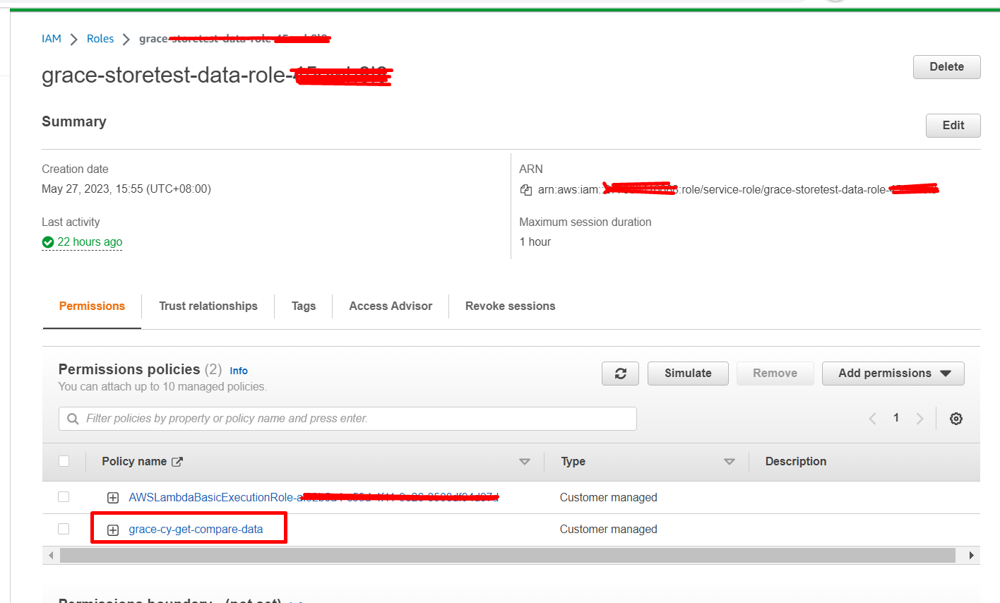

As you see below, you can put items when executing the script and new item will be added in the table

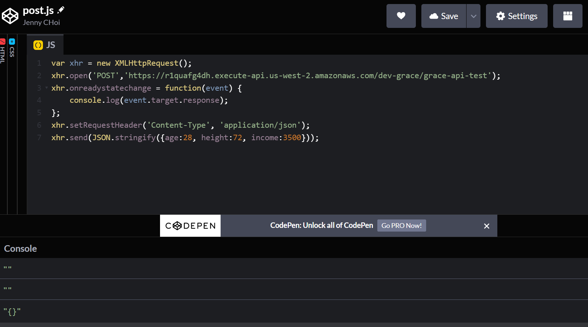

We can create another policy allowing scanning
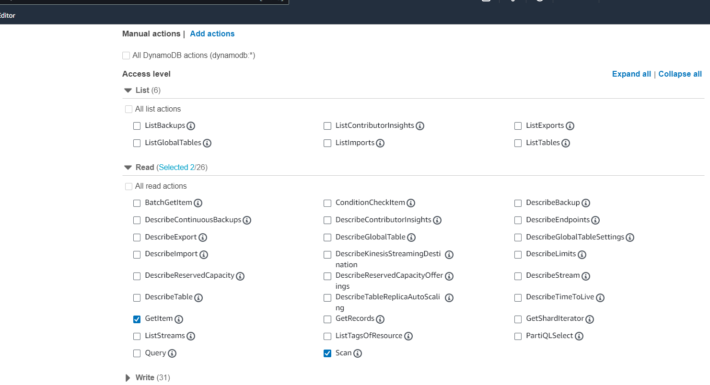

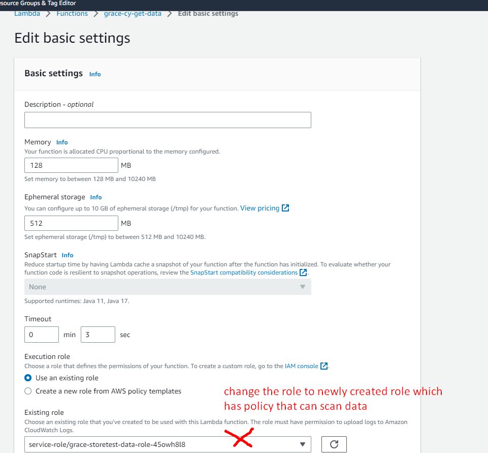
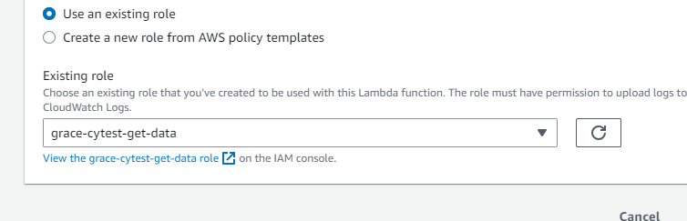

As you see here, you can get and scan data

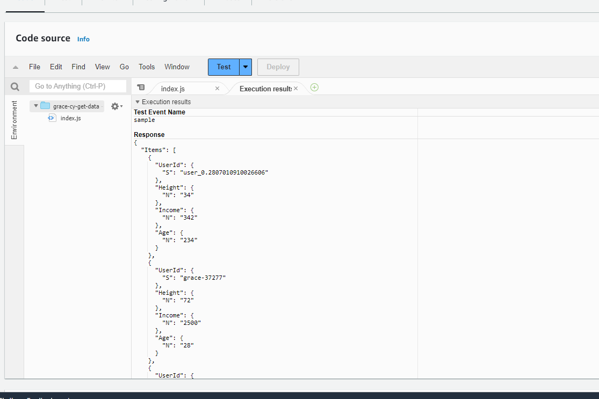

# Restructuring the Fetch data in Lambda

Going back to the code block, we will transform it again to have better scan data when specific url api was triggered

```javascript
const AWS = require('aws-sdk')
const dynamodb = new AWS.DynamoDB({region:'us-west-2', apiVersion: '2012-08-10'});

exports.handler = (event, context, callback) => {
    const type = event.type;
    if (type === 'all') {
        const params = {
            TableName: "grace-compare-yourself"
        };
        dynamodb.scan(params,function(err,data) {
            if (err) {
                console.log(err);
                callback(err);
            } else {
                console.log(data);
                callback(null, data);
            }
        });
    } else if (type === 'single') {
        callback(null,'Just my data');
    } else {
        callback(null,'Hello from Lambda')
    }
}
```


**Transformed Code:**

```javascript
const AWS = require('aws-sdk')
const dynamodb = new AWS.DynamoDB({region:'us-west-2', apiVersion: '2012-08-10'});

exports.handler = (event, context, callback) => {
    const type = event.type;
    if (type === 'all') {
        const params = {
            TableName: "grace-compare-yourself"
        };
        dynamodb.scan(params,function(err,data) {
            if (err) {
                console.log(err);
                callback(err);
            } else {
                console.log(data);
                const items = data.Items.map(
                    (dataField) => { 
                        return {age: +dataField.Age.N, height: +dataField.Height.N, income: +dataField.Income.N};

                    }
                );
                callback(null, items);
            }
        });
    } else if (type === 'single') {
        callback(null,'Just my data');
    } else {
        callback(null,'Hello from Lambda')
    }
}
```

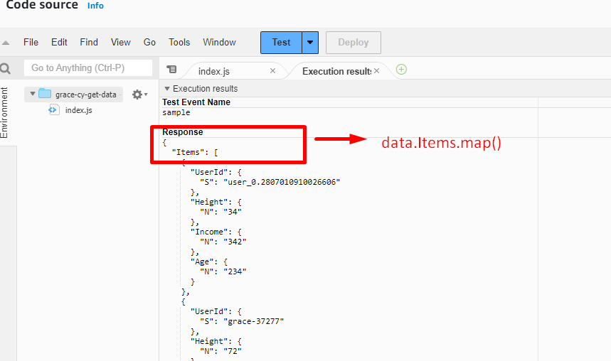

We called the map function - java script to transform each element in an array and return a new array which will be stored in the items constant
map and take function input where datafield as an input and will be added and sent to function automatically {} executed on the element on each array and then transform that {array to returb a transformed item which holds another java script object {which holds age property, the individual item on the map iteration method then acces age dataField.Age.N which holds object as a value}}. Then add (+) to make it as integer

return items in the callback


We have now restructured the array with much simpley key value pair

# Getting a Single Data from DYNAMO DB Lambda

We will further restaructure our get function

*Previous code below*
*index.js*
```javascript

const AWS = require('aws-sdk')
const dynamodb = new AWS.DynamoDB({region:'us-west-2', apiVersion: '2012-08-10'});

exports.handler = (event, context, callback) => {
    const type = event.type;
    if (type === 'all') {
        const params = {
            TableName: "grace-compare-yourself"
        };
        dynamodb.scan(params,function(err,data) {
            if (err) {
                console.log(err);
                callback(err);
            } else {
                console.log(data);
                const items = data.Items.map(
                    (dataField) => { 
                        return {age: +dataField.Age.N, height: +dataField.Height.N, income: +dataField.Income.N};

                    }
                );
                callback(null, items);
            }
        });
    } else if (type === 'single') {
        callback(null,'Just my data');
    } else {
        callback(null,'Hello from Lambda')
    }
}
```

*Now adding logic to get specific data*


Based from the documentation of GetItem class in Dynamod DB SDK >> *https://docs.aws.amazon.com/AWSJavaScriptSDK/latest/AWS/DynamoDB.html*

```javascript
/* This example retrieves an item from the Music table. The table has a partition key and a sort key (Artist and SongTitle), so you must specify both of these attributes. */

 var params = {
  Key: {
   "Artist": {
     S: "Acme Band"
    }, 
   "SongTitle": {
     S: "Happy Day"
    }
  }, 
  TableName: "Music"
 };
 dynamodb.getItem(params, function(err, data) {
   if (err) console.log(err, err.stack); // an error occurred
   else     console.log(data);           // successful response
   /*
   data = {
    Item: {
     "AlbumTitle": {
       S: "Songs About Life"
      }, 
     "Artist": {
       S: "Acme Band"
      }, 
     "SongTitle": {
       S: "Happy Day"
      }
    }
   }
   */
 });
```

```javascript
const AWS = require('aws-sdk')
const dynamodb = new AWS.DynamoDB({region:'us-west-2', apiVersion: '2012-08-10'});

exports.handler = (event, context, callback) => {
    const type = event.type;
    if (type === 'all') {
        const params = {
            TableName: "grace-compare-yourself"
        };
        dynamodb.scan(params,function(err,data) {
            if (err) {
                console.log(err);
                callback(err);
            } else {
                console.log(data);
                const items = data.Items.map(
                    (dataField) => { 
                        return {age: +dataField.Age.N, height: +dataField.Height.N, income: +dataField.Income.N};

                    }
                );
                callback(null, items);
            }
        });
    } else if (type === 'single') {
        const params = {
            Key : {
                "UserId" : {
                    S : "grace-37277"
                }
            },
            TableName: "grace-compare-yourself"
        };
        dynamodb..getItem(params, function(err, data) {
            if (err) {
                console.log(err);
                callback(err);
            } else {
                console.log(data);
                const
                callback(null,data);
            }
        });
    } else {
        callback(null,'Something went wrong')
    }
}
```

After that configure test event and set it to single. The result is for user id grace-37277 only
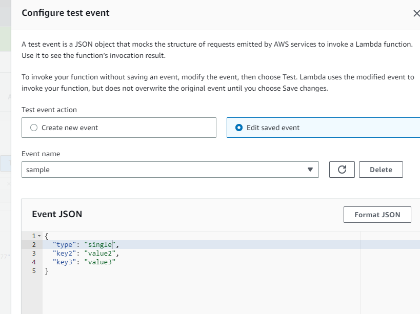
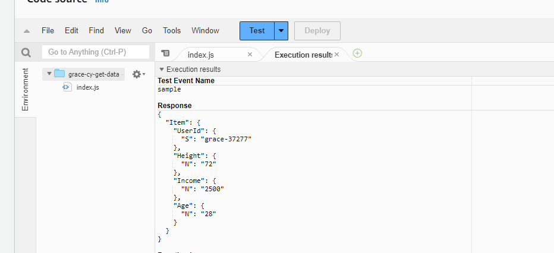

Now if you want to return just the age only, you can modify the scpecific script here

```javascript
        dynamodb..getItem(params, function(err, data) {
            if (err) {
                console.log(err);
                callback(err);
            } else {
                console.log(data);
                callback(null, {age : +data.Item.Age.N, height : +data.Item.Height.N, income : +data.Item.Income.N});
```

As tested, it only return Age, Height and Income only

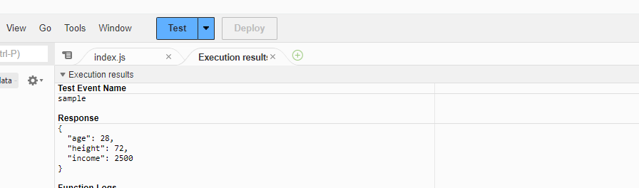

#Testing it from Web and Passing it Correct

# Testing it from Web and Passing it Correct

Go again to codepen.io

```javascript
var xhr = new XMLHttpRequest();
xhr.open('GET','Get_api_function/[all,single]');
xhr.onreadystatechange = function(event) {
    console.log(event.target.response);
};
xhr.setRequestHeader('Content-Type', 'application/json');
xhr.send();
```

Execute th get function and we get all array data
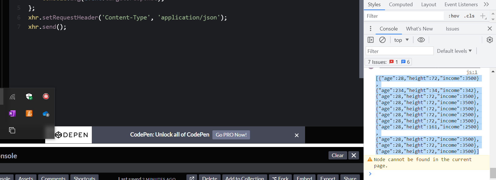

Testing with single


Adding parse

```javascript
var xhr = new XMLHttpRequest();
xhr.open('GET','Get_api_function/[all,single]');
xhr.onreadystatechange = function(event) {
    console.log(JSON.parse(event.target.response));
};
xhr.setRequestHeader('Content-Type', 'application/json');
xhr.send();
```
Will get json return
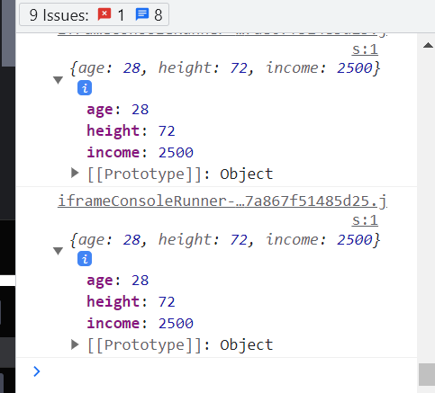

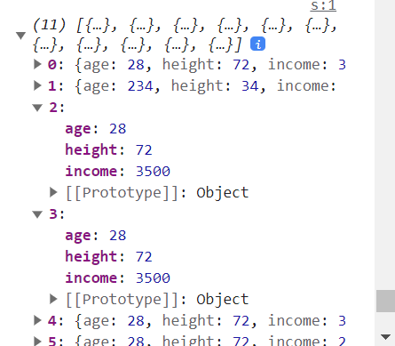


# Preparing Delete Permissions

exports.handler = (event, context, callback) => {
    callback(null, 'Deleted!');
};

*Method Request*
Dafault

*Integration Request*
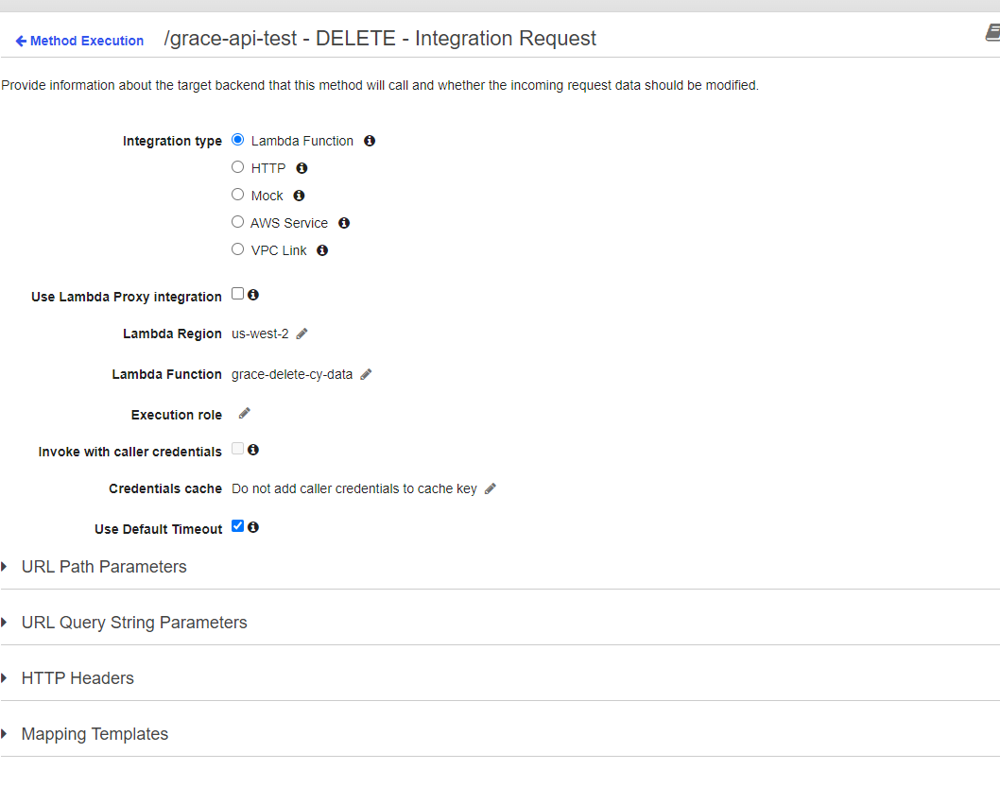
No mapping template

*Integration Response*
Default

*Method Response*
Default


Current Permission
*grace-delete-cy-data function*

Setting up the grace-delete-cy-data code

```javascript
const AWS = require('aws-sdk')
const dynamodb = new AWS.DynamoDB({region:'us-west-2', apiVersion: '2012-08-10'});

```

Go to IAM and create a new policy

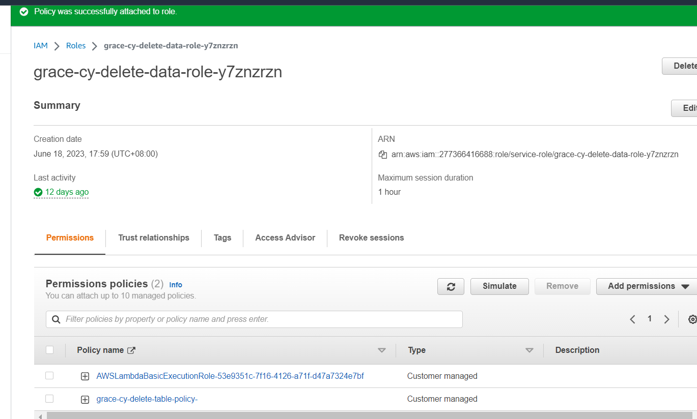

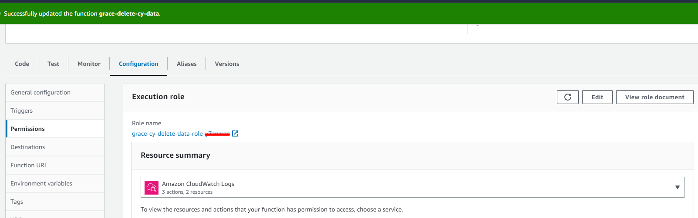

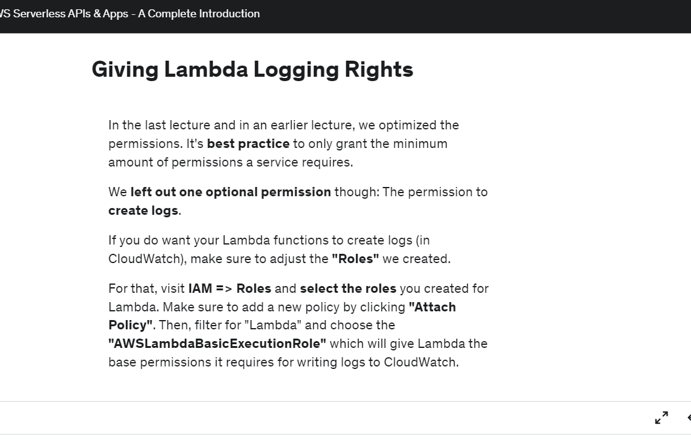

# Deleting Items in DynamoDB Lambda

Lets look the Delete method in the API *https://docs.aws.amazon.com/AWSJavaScriptSDK/latest/AWS.html*

Based on the API
**To delete an item**

```javascript
/* This example deletes an item from the Music table. */

 var params = {
  Key: {
   "Artist": {
     S: "No One You Know"
    }, 
   "SongTitle": {
     S: "Scared of My Shadow"
    }
  }, 
  TableName: "Music"
 };
 dynamodb.deleteItem(params, function(err, data) {
   if (err) {
    console.log(err); // an error occurred
    callback(err); 
   } else {
    console.log(data); // successful response
    callback(null,data);          
   }
 });
};

   /*
   data = {
    ConsumedCapacity: {
     CapacityUnits: 1, 
     TableName: "Music"
    }
   }
   */
 });
```
As checked, we need a Key and a TableName

Lets now do the coding:

```javascript
const AWS = require('aws-sdk')
const dynamodb = new AWS.DynamoDB({region:'us-west-2', apiVersion: '2012-08-10'});

exports.handler = (event, context, callback) => {
    // TO DO implement
    const params = {
        Key: {
            "UserId" : {
                S: "grace-37277"
            }
            },
        TableName: "grace-compare-yourself"
    };
    
dynamodb.deleteItem(params, function(err, data) {
   if (err) {
    console.log(err); // an error occurred
    callback(err); 
   } else {
    console.log(data); // successful response
    callback(null,data);          
   }
 });
};

```

Delete function in codepen.io
```javascript
var xhr = new XMLHttpRequest();
xhr.open(
  "DELETE",
  "api_link/grace-api-test"
);
xhr.onreadystatechange = function (event) {
  console.log(JSON.parse(event.target.response));
};
xhr.setRequestHeader("Content-Type", "application/json");
xhr.send();
```

Upon executing he API, the grace-37277 was deleted

# Mapping DynamoDB Responses

For example, going to Method Response of the API
We have "application/json" setting here and empty model
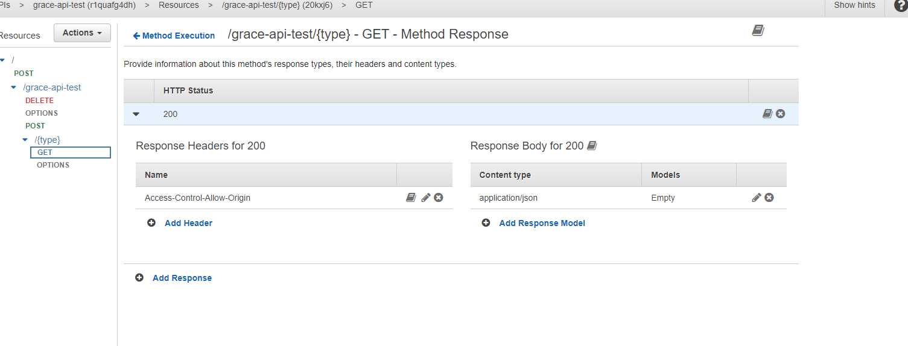

We can create a model though for that specific array
change the type to array

Model:GraceCompareDataArray

{
  "$schema": "http://json-schema.org/draft-04/schema#",
  "title": "GraceCompareData",
  "type": "array",
  "items": {
      "type": "object",
      "properties": {
      "age": {"type": "integer"},
      "height": {"type": "integer"},
      "income": {"type": "integer"}
  },
  "required": ["age", "height", "income"]
}
}

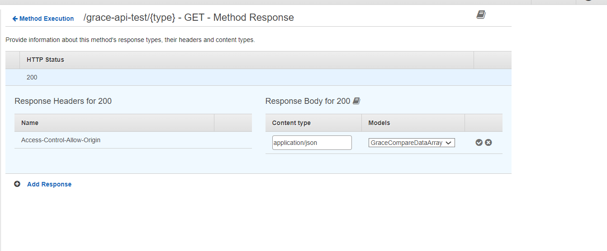

Then testing the API

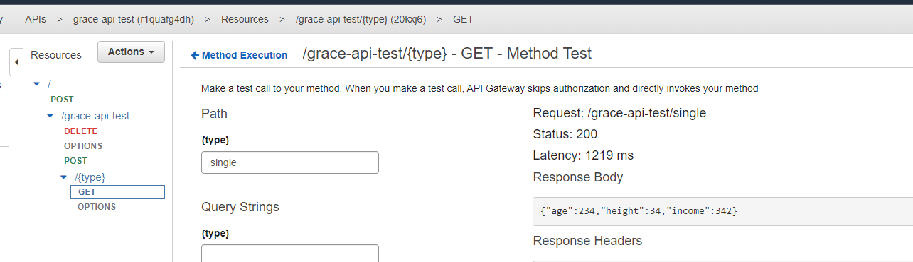

getting the user_0.2807010910026606 data
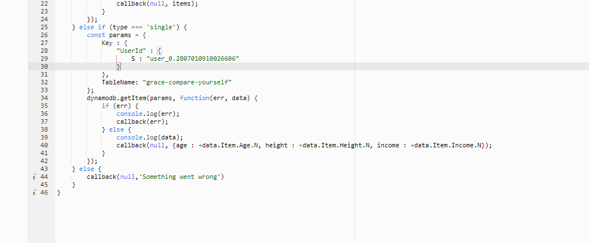

And then assign the model to method response

And in the integration response if we edit body mapping template to user GraceCompareDataArray

AS you see here, it transform anything lambda gives us into Array

```javascript
#set($inputRoot = $input.path('$'))
[
##TODO: Update this foreach loop to reference array from input json
#foreach($elem in $inputRoot)
 {
  "age" : $elem.Age,
  "height" : $elem.Height,
  "income" : $elem.Income
} 
#if($foreach.hasNext),#end
#end
]
```

if we check again, we get back array result however ,its not for single item and has no value

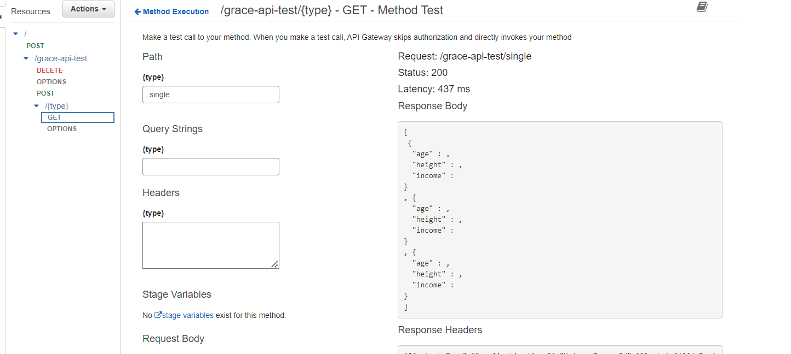

To return an array for that single item, we need to modify the code as well putting a bracket
     callback(null, **[**{age : +data.Item.Age.N, height : +data.Item.Height.N, income : +data.Item.Income.N}**]**);

Hence when we test again after modiying our get function
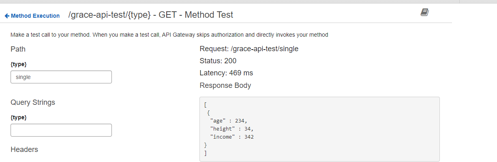

Now, the response is supoer clear with array objects