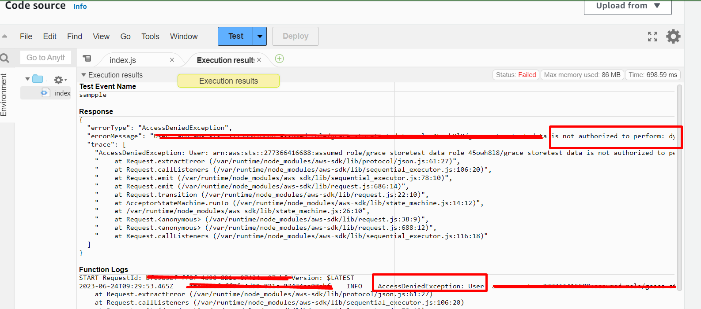
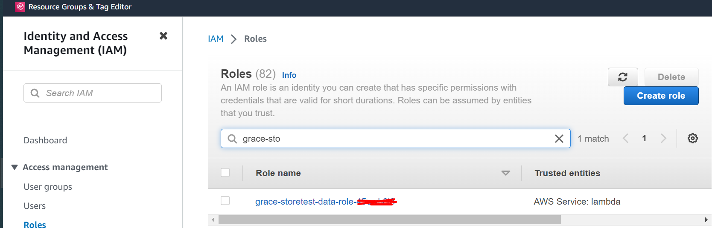
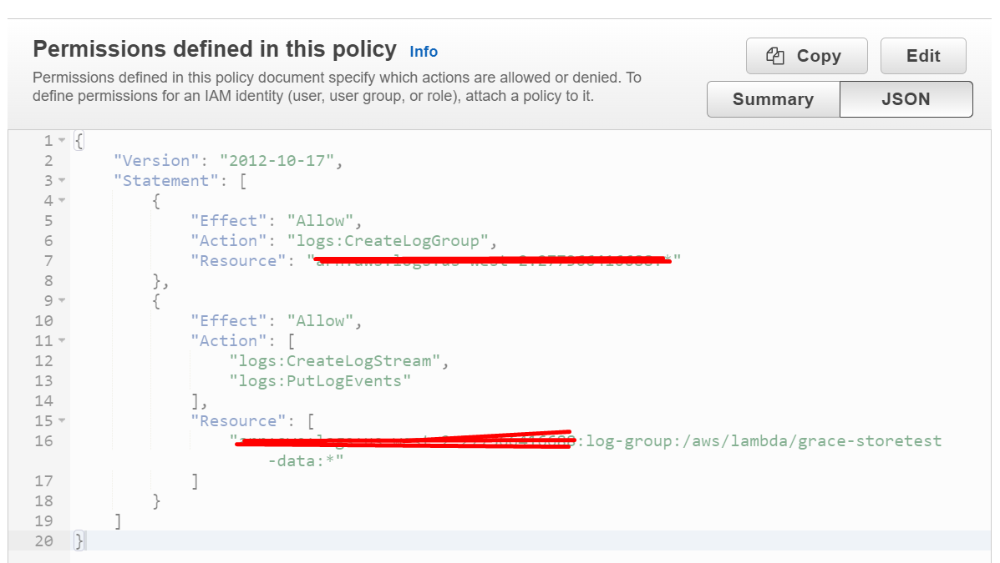
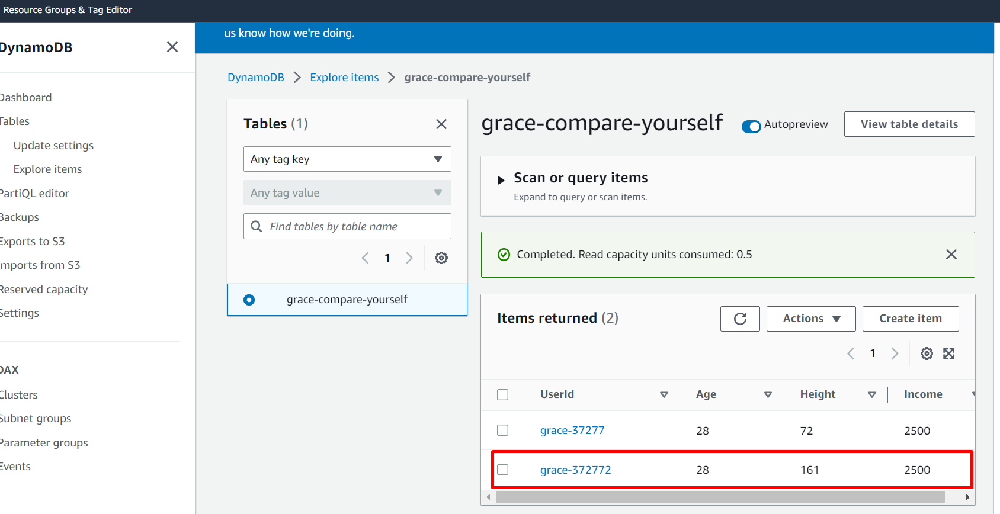

# Serverless_notes

**DYNAMO DB link SDK for reference - https://docs.aws.amazon.com/AWSJavaScriptSDK/latest/AWS.html**

# Getting Stated with Dynamo DB

**Lambda Configuration**
This is just for the first example where in you will call dynamo db function

*Dont forget to call dynamodb in your lambda, to do this follow the docs.aws.amazon.com link I sent above and find constructor how to do it. Anyway, below is the specific line*

**Sending a Request Using DynamoDB**

```javascript
var dynamodb = new AWS.DynamoDB();
dynamodb.batchExecuteStatement(params, function (err, data) {
  if (err) console.log(err, err.stack); // an error occurred
  else     console.log(data);           // successful response
});
##Locking the API Version
##In order to ensure that the DynamoDB object uses this specific API, you can construct the ##object by passing the apiVersion option to the constructor:

var dynamodb = new AWS.DynamoDB({apiVersion: '2012-08-10'});

##If you are not in specific region where you deployed the database, its required to put the region like the one below:
const dynamodb = new AWS.dynamodb({region:'us-west-2', apiVersion: '2012-08-10'});

```


**Example Code**
```javascript
const AWS = require('aws-sdk');
const dynamodb = new AWS.DynamoDB({region:'us-west-2', apiVersion: '2012-08-10'});

exports.handler = (event,context,callback) => {
    console.log(event);
    const age= event.age;
    callback(null, age * 2);
};
```

# HOW TO PUT ITEMS in the dynamo db created

There must be Table and Item *please see the dynamodb.putitem function*

/* This example adds a new item to the Music table. */

```javascript
var params = {
  Item: {
   "AlbumTitle": {
     S: "Somewhat Famous"
    }, 
   "Artist": {
     S: "No One You Know"
    }, 
   "SongTitle": {
     S: "Call Me Today"
    }
  }, 
  ReturnConsumedCapacity: "TOTAL", 
  TableName: "Music"
 };
 dynamodb.putItem(params, function(err, data) {
   if (err) console.log(err, err.stack); // an error occurred
   else     console.log(data);           // successful response
   /*
   data = {
    ConsumedCapacity: {
     CapacityUnits: 1, 
     TableName: "Music"
    }
   }
   */
 });
```

 **Hence this is the final code in the lambda for putting data, by the way, I am using Node js 16.X**

```javascript
const AWS = require('aws-sdk')
const dynamodb = new AWS.DynamoDB({region:'us-west-2', apiVersion: '2012-08-10'});
exports.handler = (event,context,callback) => {
    
    const params = {
        Item: {
            "UserId": {
                S: "grace-adsdasw"
            },
            "Age": {
                N: "28"
            },
            "Height": {
                N: "161"
            },
            "Income": {
                N: "2500"
            }
        },
        TableName:"grace-compare-yourself"
    };
    dynamodb.putItem(params, function(err, data) {
        if (err) {
            console.log(err);
            callback(err); 
        } else {
            console.log(data);
            callback(null, data)
        }
            });
    };
```

# TESTING THE LAMBDA CODE WHERE YOU WANT TO PUT ITEMS IN DYNAMODB



You will see that access denied. 

# Setting Permission Right in DynamoDB

You can search "IAM" role in AWS



We need to attach new policy


*Once you tested it, it will return empty result because you havent configured yet the desired return*


*When you got to the dynamodb again, you will see that there was added item in the table, this was executed when you tested you lamnda function which puts data in the dynamodb table*


# Using Api Gateway(Request) Data for Item Creation