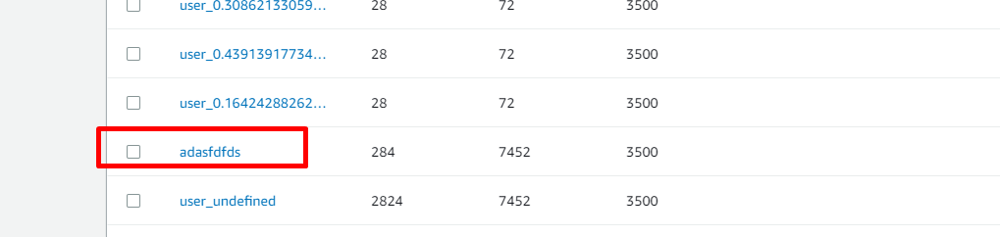
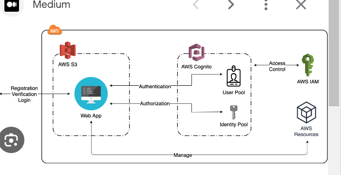
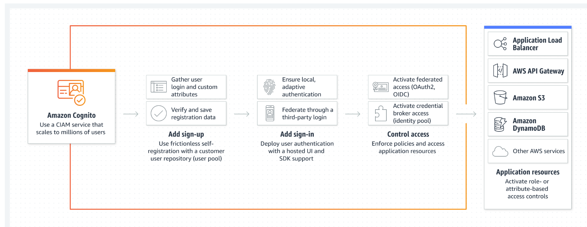

Our API must have authentication
Only authenticated users must only be the one to use our API endpoints

# How to add authorization to API Gateway

**Method Request** - our gatekeeper making sure that ony valid request are handled

The Authorization AWS IAM is only applicable if you wanted to restrict usage to those that has IAM role only


However, if you want your API to be publicly available and still wants restriction, you must use authorizer

Lambda authorizer (formerly Custom Authorizer) uses Lambda code to authorize users and generate JWT token


It returns IAM policy to us, temporarily use by API gateway and then decide to authenticate if you are the users and allowed. It will expire after certain time

Need to get authorization token and then
Return policy and Principal ID of user if access was granted
Return data as optional

Lets try extracting the token first, this will be done in the lambda script.
Take note the policy version which you will get when you got to IAM policy and check the json file of the policy

```javascript
exports.handler = (event, context, callback) => {
    // TODO implement
    const token = event.authorizationToken;

    // Use token
    if (token === 'allow') {
    
        const policy = genPolicy('allow', event.methodArn) //if allow, generate policy. the methodarn is infor API gateway passed to this function, search API gateway custom authorizer link in https://docs.aws.amazon.com/apigateway/latest/developerguide/api-gateway-lambda-authorizer-input.html
        const principalId = 'adasfdfds';
        const context = {
            simpleAuth: true
        };
        const response ={
            principalId: principalId,
            policyDocument: polciy,
            context: context
        };
        callback(null,response);
    } else if (token === 'deny') {
        const policy = genPolicy('deny', event.methodArn);
        const principalId = 'adasfdfds';
        const context = {
            simpleAuth: true //key value pairs very bad auth
        };
        const response = {
            principalId: principalId, //output format written here https://docs.aws.amazon.com/apigateway/latest/developerguide/api-gateway-lambda-authorizer-output.html
            policyDocument: policy,
            context: context
        };
        callback(null,response);
    } else {
        callback('Unauthorized');
    }        
    };

function genPolicy(effect, resource) {
    const policy = {};
    policy.Version = '2012-10-17'
    policy.Statement = [];
    const stmt = {};
    stmt.Action = 'execute-api:Invoke'; //IAM term for allowing and controlling invocation of api
    stmt.Effect = effect; //effect passed to function allow or deny
    stmt.Resource = resource; //what did we try to invoke and must pass to function
    policy.Statement.push(stmt); //push the new statement with element
    return policy
}
    
```


And then assign role


Now we created an authorization function, next is to connect it to API gateway to deny or allow

# Lambda Authorizer: Provided Input Expected Output
When creating lambda authorizer functions, you can rely on receiving certain data as input but you also have to keep a certain format when it comes to the data you actually return in your function.

You can read more about it here: https://docs.aws.amazon.com/apigateway/latest/developerguide/api-gateway-lambda-authorizer-input.html

The following input data is provided to you:

```javascript
{
    "type":"TOKEN",
    "authorizationToken":"{caller-supplied-token}",
    "methodArn":"arn:aws:execute-api:{regionId}:{accountId}:{apiId}/{stage}/{httpVerb}/[{resource}/[{child-resources}]]"
}
```
<caller-supplied-token>  is the token you actually receive. You configure how to extract the token from the incoming request in API gateway.

methodArn  simply refers to the endpoint on which this authorizer was triggered.

The following output data has to be provided by your function (via callback() ):

```javascript
{
  "principalId": "yyyyyyyy", // The principal user identification associated with the token sent by the client.
  "policyDocument": {
    "Version": "2012-10-17",
    "Statement": [
      {
        "Action": "execute-api:Invoke",
        "Effect": "Allow|Deny",
        "Resource": "arn:aws:execute-api:{regionId}:{accountId}:{apiId}/{stage}/{httpVerb}/[{resource}/[{child-resources}]]"
      }
    ]
  },
  "context": {
    "stringKey": "value",
    "numberKey": "1",
    "booleanKey": "true"
  },
  "usageIdentifierKey": "{api-key}"
}
```
principalId  simply is the user identifier.

policyDocument  is a JS object which uses the IAM policy structure (as shown in the above example).

context  is the only optional attribute. It simply is an object of key-value pairs of your choice.

# UI for setting up Lambda Authorizer
Some users may see an updated UI for the API Gateway Authorizer creation. 

There, you should just enter "Authorization"  into the "Token Source"  field, NOT method.request.headers.Authorization . Otherwise, you will get a 401 error.

# Using Lambda Authorizer

Now got to APi gateway and use the authorizer


https://docs.aws.amazon.com/apigateway/latest/developerguide/request-response-data-mappings.html - use the link for the token source
As seen in image, here is the setting


As a result:


and if we pass not applicable token, we get error


Now we go to our actual APi and connect it there, in POST API


Then deploy the APi to see if it works as expected

so bcak to codepen.io
Need to specify in the code the header authorization

returning {} in codepen and we see in dynamo that user created


user created when setting header to allow


setting header to deny has error 403


now for invalid header, its error 401


# Retrieving Users using custom Authorizers

To retrieve specific Users in the return request, we use the POST method's Integration Request'd Body mapping template

We will now add $context.authorizer.principalId (reference- https://docs.aws.amazon.com/apigateway/latest/developerguide/api-gateway-mapping-template-reference.html) to access the principal Id

```javascript
#set($inputRoot = $input.path('$'))
{
  "age" : "$inputRoot.age",
  "height" : "$inputRoot.height",
  "income" : "$inputRoot.income",
  "userId" : "$context.authorizer.principalId"
}
```
Going back to the lambda function the POST API used, we can now reference the userId because it was being added in the body mapping template of the integration request

```javascript
const AWS = require('aws-sdk');

const dynamodb = new AWS.DynamoDB({region:'us-west-2', apiVersion: '2012-08-10'});

exports.handler = (event,context,callback) => {
    
    const params = {
        Item: {
            "UserId": {
                S: event.userId //from Math.random() to event.userId
            },
            "Age": {
                N: event.age
            },
            "Height": {
                N: event.height
            },
            "Income": {
                N: event.income
            }
        },
        TableName:"grace-compare-yourself"
    };
    
    
    dynamodb.putItem(params, function(err, data) {
        if (err) {
            console.log(err);
            callback(err); 
        } else {
            console.log(data);
            callback(null, data);
        }
            });
    };
```

After that, redeploy the API and test the added data

Upon testing in codepen.io, the user authenticated in lambda authorizer  was now added

```javascript
var xhr = new XMLHttpRequest();
xhr.open('POST','https://r1quafg4dh.execute-api.us-west-2.amazonaws.com/dev-grace/grace-api-test');
xhr.onreadystatechange = function(event) {
    console.log(event.target.response);
};
xhr.setRequestHeader('Content-Type', 'application/json');
xhr.setRequestHeader('Authorization', 'allow');
xhr.send(JSON.stringify({age:284, height:7452, income:3500}));

```


# What is AWS Cognito

Amazon Cognito is very useful in WEb App and Mobile App
Issue not only temp token but also temporary IAM role

>Define how to Authenticate Users
> Store Authe Token on User Devices
> 

> Cognito User Pools
> Thirdparty Provider like Facebook and Google




AWS Cognito: Useful Resources & Links
In this module, we're using AWS Cognito, specifically its "User Pools" feature.

Learn more about AWS Cognito and this feature with the following links:

Overview: https://aws.amazon.com/cognito/
Cognito User Pools Developer Guide: http://docs.aws.amazon.com/cognito/latest/developerguide/cognito-user-identity-pools.html
As always, also don't forget to check the pricing if you plan on expanding your usage: https://aws.amazon.com/cognito/pricing/

